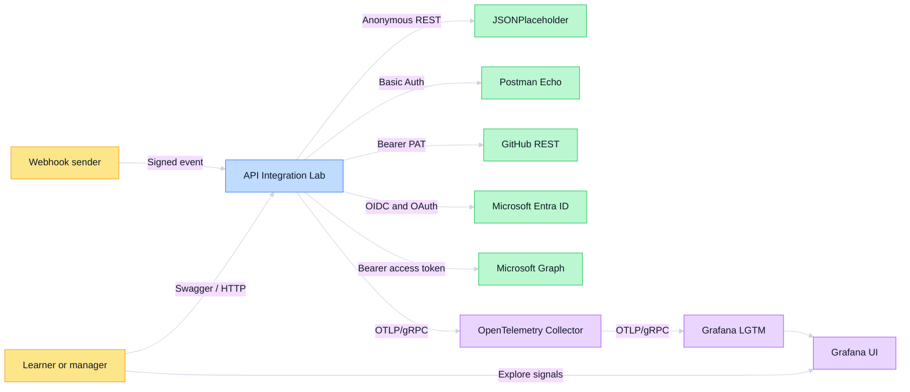
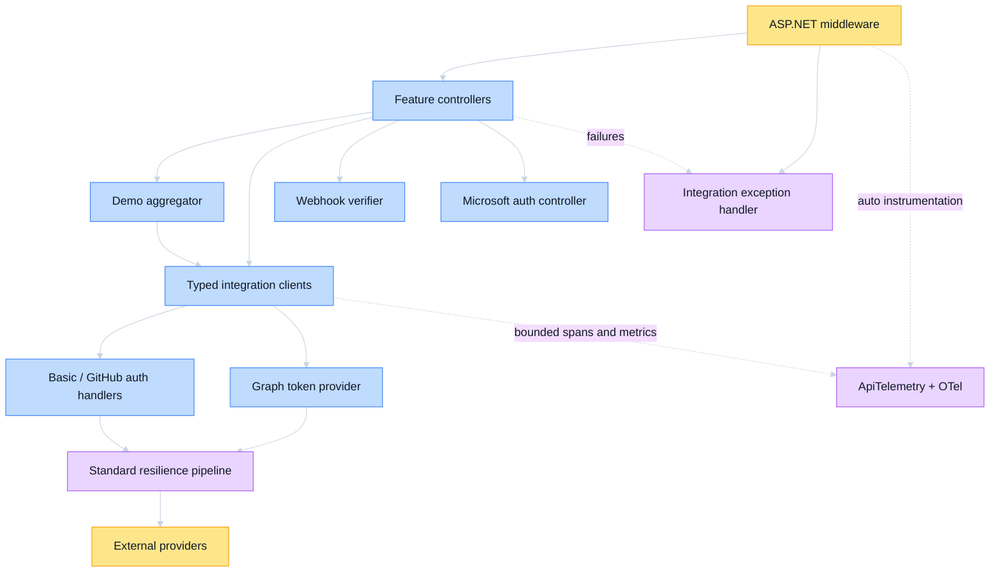
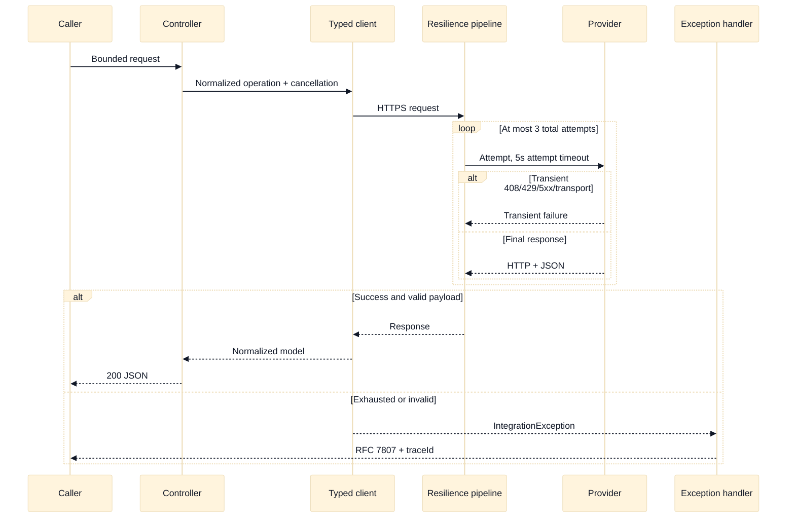
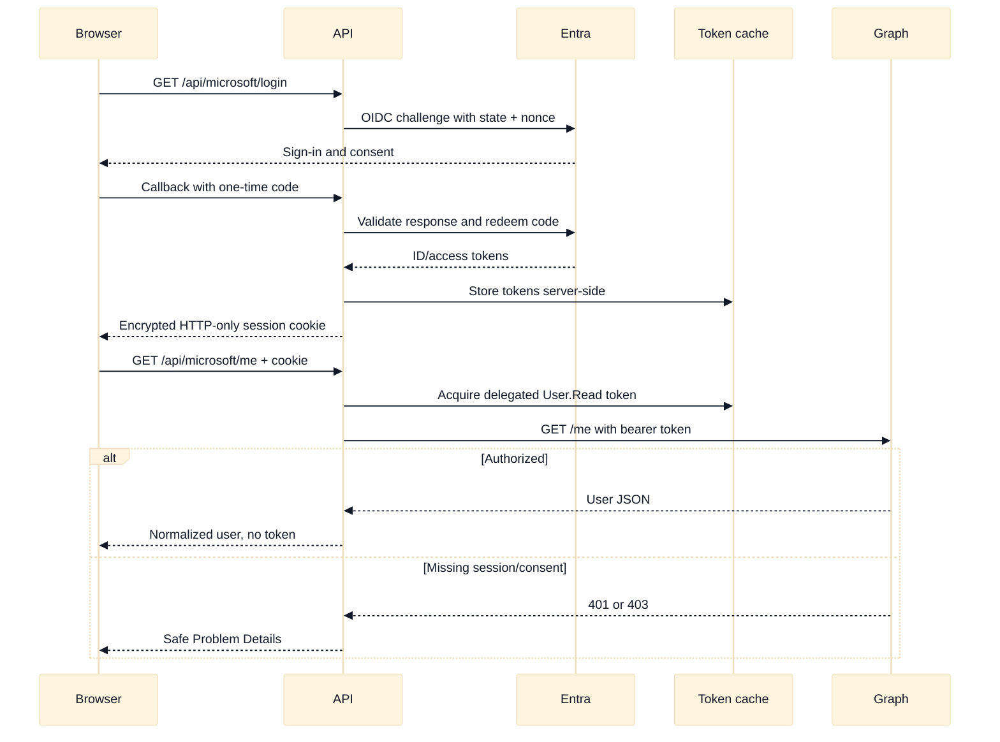
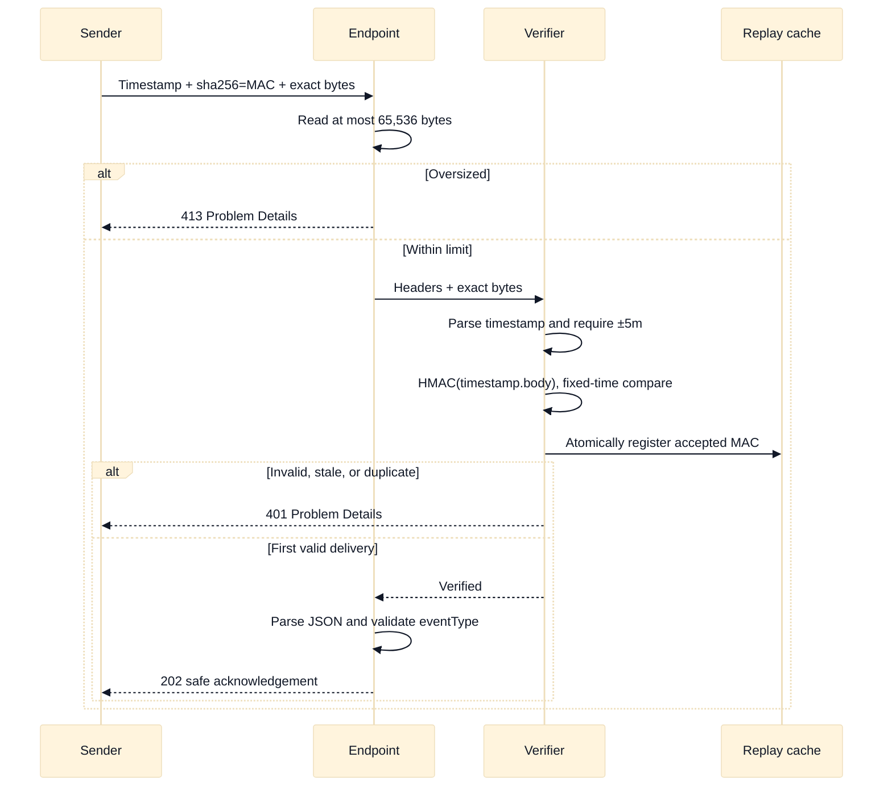
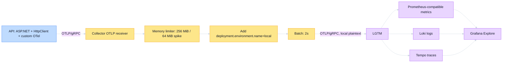

# Architecture

## Purpose and Scope

The API Integration Lab is a single .NET 8 service built to teach and demonstrate integration
boundaries: choosing an identity, placing credentials, calling an external contract, normalizing
responses, containing failure, and producing safe telemetry. It is deliberately a localhost lab,
not a production platform or a collection of independently deployed microservices.

The service owns its public HTTP contract, input bounds, credential attachment, provider response
normalization, error classification, resilience policy, aggregation, and telemetry. GitHub,
Microsoft, JSONPlaceholder, and Postman Echo own their identities, data, APIs, and availability.

## System Context (C4 Level 1)



Trust crosses the browser/API boundary, webhook sender/API boundary, every outbound provider
boundary, and the API/telemetry boundary. Credentials are accepted or acquired only at those
explicit seams.

## Container View (C4 Level 2)

| Container | Runtime | Responsibility | State |
| --- | --- | --- | --- |
| API | ASP.NET Core on .NET 8 | HTTP surface, auth, typed provider clients, normalization, aggregation, errors, instrumentation | Encrypted browser cookie, in-memory Graph token cache, in-memory webhook replay cache |
| OTel Collector | Collector Contrib `0.160.0` | Receive OTLP, cap memory, add local environment, batch, forward | Process memory only |
| Grafana LGTM | `grafana/otel-lgtm:0.33.0` | Local Loki, Grafana, Tempo, and Prometheus-compatible exploration | Container-local development data |

Docker Compose creates one private network. Only API port `8080` and Grafana port `3000` are
published. The API and Collector configuration are not mounted writable.

## Component View (C4 Level 3)



Feature folders keep each provider's controller, options, DTOs, normalized models, client, and auth
handler together. `Common/` contains only policies shared across providers: errors, resilience,
telemetry, validation, Swagger, health, and time.

## Critical Code Paths (C4 Level 4)

| Path | Key types | Why it warrants detail |
| --- | --- | --- |
| Provider call | Controller → `I*Client` → typed client → optional auth handler → resilience handler | Shows the distinction between API authentication, outbound credential placement, provider failure, and safe normalization |
| Delegated Graph | `MicrosoftAuthController` → OIDC middleware → `MicrosoftGraphTokenProvider` → `MicrosoftGraphClient` | Combines browser state, user identity, server token acquisition, and downstream API authorization |
| App-only Graph | `MicrosoftGraphController` → token provider application flow → Graph client | Represents the workload rather than a browser user |
| Webhook | `WebhookController` → `WebhookSignatureVerifier` → JSON parse | Security requires exact bytes and verification before deserialization |
| Aggregate | `DemoController` → `DemoAggregator` → three provider tasks | Demonstrates concurrency and partial success without masking unexpected defects |

## Integration Architecture

| External system | Direction | Protocol | Authentication | Failure behavior | Contract owner |
| --- | --- | --- | --- | --- | --- |
| JSONPlaceholder | Outbound | HTTPS REST/JSON | None | Transient failures retry; final failures become bounded upstream/timeout errors | JSONPlaceholder |
| Postman Echo | Outbound | HTTPS REST/JSON | Basic header | Missing local config becomes 503; provider auth becomes 401/403 | Postman Echo |
| GitHub REST | Outbound | HTTPS REST/JSON | Bearer PAT | Bounded pagination; cross-host links rejected; 429/limit exhaustion retains retry delay | GitHub |
| Microsoft Entra ID | Outbound/browser | OIDC + OAuth 2.0 | Auth Code or Client Credentials | Explicit login redirects; protected APIs keep 401/403 semantics | Microsoft |
| Microsoft Graph | Outbound | HTTPS REST/JSON | Bearer access token | Delegated and app-only paths map provider/auth/timeout failures safely | Microsoft |
| Webhook sender | Inbound | HTTP POST/JSON | HMAC-SHA256 | Reject oversized, stale, malformed, invalid, or replayed deliveries before processing | Sender and this API share the signing contract |
| OTel Collector | Outbound | OTLP/gRPC | Local network trust | Application work continues if export is unavailable; SDK/Collector buffering remains bounded | This repository |

## Critical Sequence Flows

### Outbound provider call



### Delegated Authorization Code



### Exact-body HMAC verification



### Concurrent aggregate

```mermaid
%%{init: {'theme':'base','themeVariables':{'background':'#111827','primaryTextColor':'#111827','lineColor':'#cbd5e1','fontFamily':'Inter, sans-serif'}}}%%
sequenceDiagram
    participant Browser
    participant Demo
    participant Public
    participant GitHub
    participant Graph
    Browser->>Demo: GET /api/demo with session cookie
    par Independent calls start together
        Demo->>Public: Posts
    and
        Demo->>GitHub: Repositories
    and
        Demo->>Graph: Delegated profile
    end
    Public-->>Demo: Success or IntegrationException
    GitHub-->>Demo: Success or IntegrationException
    Graph-->>Demo: Success or IntegrationException
    alt At least one success
        Demo-->>Browser: 200, one envelope per provider
    else All expected provider calls fail
        Demo-->>Browser: 502 Problem Details
    end
    Note over Demo: Caller cancellation propagates; unexpected bugs are not converted to provider failures
```

### Telemetry export



## Data Flow and State

1. ASP.NET validates route/query inputs before provider I/O where possible.
2. A controller calls a provider interface or the aggregate interface with the caller's cancellation
   token.
3. An auth handler or token provider adds credentials only after confirming HTTPS.
4. The shared resilience handler bounds each attempt and the whole operation.
5. Provider DTOs are validated and mapped into smaller owned response models.
6. Expected failures become `IntegrationException`; the global handler emits safe RFC 7807 JSON.
7. Logs, metrics, and spans carry bounded operational dimensions, never credentials or payloads.

No provider response is persisted. In-memory Microsoft tokens, cookie keys, and accepted webhook
MACs are lost on restart, which is correct for this local lab and unsuitable for multiple replicas.

## Deployment Architecture

The only supported deployment is Docker Compose on one developer machine. The API calls internet
providers over HTTPS and sends OTLP to the Collector over the private Compose network. The Collector
forwards to LGTM over that same network. The optional corporate-CA override mounts the host's public
trust bundle read-only; build-time restore uses a BuildKit secret that is absent from final layers.

There is no environment-promotion flow, ingress, cloud load balancer, Kubernetes workload, or
multi-region topology.

## Security and Trust Boundaries

- Browser sessions cross the local HTTP boundary and rely on encrypted HTTP-only cookies.
- Basic, GitHub, and Graph credentials cross only HTTPS provider boundaries.
- HMAC proves possession of a shared secret and binds the timestamp to exact transmitted bytes.
- The replay cache protects one process only.
- Telemetry receives operational metadata; payloads, tokens, signatures, and identities are excluded
  from custom dimensions.
- Grafana is a local development UI with no repository-defined access-control policy.

See [SECURITY.md](SECURITY.md) for the threat model.
See [resilience patterns](docs/resilience-patterns.md) for exact failure budgets and
[observability](docs/observability.md) for the signal/cardinality contract.

## Key Design Decisions

- [ADR 001](docs/adrs/adr-001-single-service-feature-folders.md): one service with provider feature
  folders and typed-client interfaces.
- [ADR 002](docs/adrs/adr-002-dual-microsoft-oauth-flows.md): separate delegated and app-only
  Microsoft OAuth flows.
- [ADR 003](docs/adrs/adr-003-exact-body-hmac-and-replay-cache.md): exact-body HMAC plus freshness
  and one-time replay detection.
- [ADR 004](docs/adrs/adr-004-otel-collector-and-local-lgtm.md): OTel-native signals through a
  standalone Collector to pinned local LGTM.

## Technology Stack

| Layer | Technology | Why |
| --- | --- | --- |
| HTTP service | ASP.NET Core / .NET 8 | Typed middleware, auth, controllers, DI, and test host |
| Provider access | Typed `HttpClient` | One provider contract and policy boundary per integration |
| Resilience | Microsoft.Extensions.Http.Resilience / Polly | Standard timeout, retry, breaker, and limiter behavior |
| Microsoft identity | Microsoft.Identity.Web | Protocol-correct OIDC/OAuth handling and token acquisition |
| API discovery | Swashbuckle | Executable Swagger UI generated from route metadata and XML remarks |
| Telemetry | OpenTelemetry .NET + Collector | Vendor-neutral instrumentation and routing |
| Local backend | Grafana LGTM | One-container exploration of metrics, logs, and traces |
| Packaging | Docker + Compose | Reproducible laptop demonstration |
| Tests | xUnit + WebApplicationFactory | Client-level and complete-host behavior without live credentials |

## Failure Modes

| Scenario | Impact | Mitigation |
| --- | --- | --- |
| Provider unavailable or slow | One operation times out or returns upstream failure | Attempt and total timeouts, bounded retry, circuit breaker, typed error |
| Provider throttles | Request returns 429 | Preserve safe Retry-After and avoid unbounded client retry |
| Missing credentials | Only that feature is unavailable | Optional startup; route returns actionable 503 or provider 401 |
| Expired/under-scoped credential | Provider returns 401/403 | Preserve auth versus authorization category without exposing body |
| Malformed provider JSON | Operation fails safely | Validate DTO and return owned upstream error |
| Malicious GitHub next link | Risk of bearer-token disclosure | Reject any pagination URI that changes host |
| Webhook replay | Duplicate event acceptance | Freshness window plus atomic accepted-MAC cache |
| API process restart | In-memory delegated token cache and replay memory lost | Sign in again; a surviving cookie alone cannot restore the token cache |
| Collector/LGTM unavailable | Telemetry temporarily absent | Bounded SDK/Collector processing; application request path remains independent |
| Every demo provider fails | No useful aggregate | Return 502; otherwise preserve partial success as 200 |

## Scaling Model

Most request handling is stateless and asynchronous, so CPU/memory and provider quotas are the first
single-process constraints. Input and pagination limits cap work per call, while the standard
resilience limiter prevents unbounded concurrent outbound work.

Horizontal scaling is intentionally unsupported: the in-memory token cache, cookie data-protection
keys, and webhook replay cache are not shared. A production multi-replica design would first need a
shared encrypted token/session strategy, durable data-protection keys, distributed replay storage,
TLS ingress, secret management, health/readiness separation, load tests, and production SLOs.

## Explicit Limitations

- Local HTTP only; do not expose this Compose stack to an untrusted network.
- No database, durable event handling, queue, or provider mutation.
- No production alert rules, dashboards-as-code, retention guarantees, or on-call ownership.
- No cloud, Kubernetes, Terraform, CI/CD, HA, DR, BCP, or multi-region design.
- External providers and internet connectivity are outside this repository's control.
