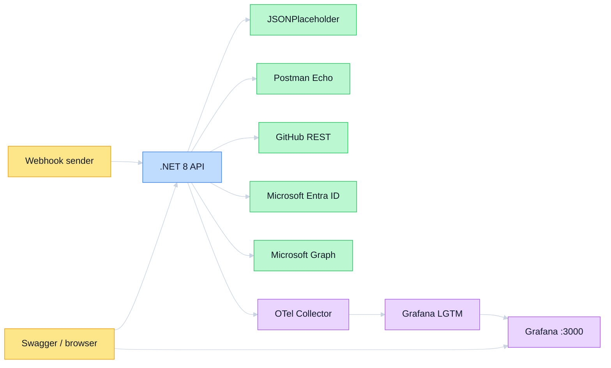

# API Integration Lab

A .NET 8 Web API that demonstrates six authentication patterns and the engineering work around
them: typed clients, normalized contracts, bounded pagination, retries/timeouts, safe errors,
OpenTelemetry, containerization, and local Grafana exploration. Swagger is the demo UI and includes
the setup and failure guidance beside each operation.

## Why this lab exists

Calling an HTTP endpoint is the easy part of integration work. This lab makes the harder boundaries
visible and executable:

- select the correct identity: anonymous, user, workload, static token, username/password, or sender;
- keep credentials in outbound headers and server-side token caches—not response bodies or logs;
- preserve partial results when independent providers fail;
- bound pagination, webhook bodies, retry time, clock skew, and telemetry dimensions;
- correlate safe Problem Details, logs, metrics, and traces without exporting sensitive payloads.

It is intentionally a backend-only lab. Swagger demonstrates the contracts without adding an
unrelated frontend framework.

## Architecture



The API exports OTLP over gRPC to a standalone Collector. The Collector applies a memory limit,
adds `deployment.environment.name=local`, batches all three signals, and forwards them to the pinned
LGTM backend.

## Authentication matrix

| Integration | Identity and protocol | Endpoint | What it proves |
|---|---|---|---|
| JSONPlaceholder | None | `GET /api/public/posts` | REST, JSON deserialization, normalization |
| Postman Echo | Basic Auth | `GET /api/basic/profile` | HTTPS `Authorization: Basic`, configuration validation |
| GitHub | Bearer/PAT | `/api/github/*` | Header injection, pagination, rate-limit metadata |
| Microsoft Graph delegated | OAuth 2.0 Authorization Code | `GET /api/microsoft/me` | Browser consent, code redemption, user token cache, cookie session |
| Microsoft Graph application | OAuth 2.0 Client Credentials | `GET /api/microsoft/users` | Workload identity and `.default` application permissions |
| Inbound webhook | HMAC-SHA256 | `POST /api/webhooks/events` | Exact-byte signing, freshness window, one-time delivery cache |

## Prerequisites

- Docker with Compose v2 for the complete API + telemetry stack.
- Optional local development: .NET SDK `8.0.131` (pinned by `global.json`).
- `curl` and `openssl` for `scripts/smoke-test.sh`.
- Provider accounts only for the credentialed routes you want to exercise. Health, Swagger, the
  public integration, validation, and expected failure paths work without credentials.

## Quick start

```bash
cp .env.example .env
# Fill only the integrations you want to exercise; empty values are supported.
docker compose --env-file .env up --build --detach
docker compose ps
```

Open:

- Swagger: <http://localhost:8080/swagger>
- Grafana: <http://localhost:3000>

Run live checks from a shell that exports the same optional values as `.env`:

```bash
scripts/smoke-test.sh
```

Stop the stack without deleting recoverable telemetry data:

```bash
docker compose down
```

### Corporate TLS interception

If an in-container restore reports `NU1301` or an unknown certificate authority, mount the host trust
bundle as an ephemeral BuildKit secret. It is available only to the restore layer and is not copied
into the image:

```bash
docker build \
  --secret id=ca_bundle,src=/etc/ssl/certs/ca-certificates.crt \
  --tag api-integration-lab:local .
docker compose \
  --file docker-compose.yml \
  --file docker-compose.corporate-ca.yml \
  --env-file .env \
  up --detach --no-build
```

## Provider configuration

Copy `.env.example` to `.env`; `.env` and all `.env.*` variants except the template are ignored.

| Variables | Configuration source | Required provider setup |
|---|---|---|
| `GITHUB_TOKEN` | GitHub fine-grained PAT | Read-only profile/repository access |
| `BASIC_AUTH_USERNAME`, `BASIC_AUTH_PASSWORD` | Local test values | Do not reuse real credentials |
| `MS_TENANT_ID`, `MS_CLIENT_ID`, `MS_CLIENT_SECRET` | Entra app registration | Web redirect URI plus Graph permissions below |
| `WEBHOOK_SECRET` | Locally generated shared secret | Same value in API and sender process |

Microsoft redirect URI:

```text
http://localhost:8080/auth/microsoft/callback
```

Grant delegated `User.Read`; grant application `User.Read.All` and tenant admin consent. Use the
client-secret **value**, not the secret object's portal ID. Restart the API after configuration
changes because authentication schemes are selected at process startup.

## Endpoint demo sequence

| Order | Request | Expected demonstration |
|---:|---|---|
| 1 | `GET /health` | `200`; liveness is independent of provider secrets |
| 2 | `GET /api/public/posts?limit=3` | No-auth outbound request and normalized posts |
| 3 | `GET /api/basic/profile` | `200` configured, actionable `503` otherwise |
| 4 | `GET /api/github/profile` | Authenticated profile or provider `401` without a token |
| 5 | `GET /api/github/repos?perPage=5&maxPages=2` | Bounded Link-header pagination |
| 6 | `GET /api/github/rate-limit` | Limit, remaining, used, reset, resource |
| 7 | `GET /api/microsoft/login` in a browser | Authorization Code redirect and consent |
| 8 | `GET /api/microsoft/me` | Delegated Graph profile using the cookie session |
| 9 | `GET /api/microsoft/users?top=10` | App-only Graph access without a user cookie |
| 10 | `POST /api/webhooks/events` | Inbound exact-byte HMAC authentication |
| 11 | `GET /api/demo` | Concurrent public/GitHub/delegated Graph envelopes |

Query parameters are constrained at the API boundary: public `limit` is 1–100, GitHub `perPage` is
1–100 and `maxPages` is 1–10, Graph `top` is 1–50, and webhook bodies are at most 64 KiB.

## Expected failure demonstrations

Failures use `application/problem+json` and include a trace ID, safe provider/category fields, and no
upstream body or secret.

| Action | Expected result | Lesson |
|---|---|---|
| Omit Basic credentials | `503 configuration` | Optional secrets do not prevent startup |
| Omit/replace GitHub PAT | GitHub `401` mapped safely | Authentication failure differs from transport failure |
| Use `limit=0`, `top=51`, or `maxPages=11` | `400` | Unbounded caller input is rejected before I/O |
| Remove Graph admin consent | `403` | Authentication can succeed while authorization fails |
| Change one signed webhook byte | `401` | MAC authenticates the exact wire representation |
| Reuse a webhook timestamp after five minutes | `401` | A valid signature alone does not prevent replay |
| Resend the identical valid delivery immediately | `401` | Freshness and one-time replay detection solve different threats |
| Make every `/api/demo` provider fail | `502` | Partial success is preserved; total failure is exceptional |

## GitHub pagination and rate limits

Repository pagination follows GitHub's `Link` header only. A full response page does not prove a next
page exists. The client stops when `rel="next"` is absent, `maxPages` is reached, or cancellation is
requested; it also rejects a next link that changes host before the bearer token can be sent.

Rate-limit headers are normalized into `limit`, `remaining`, `used`, `resetAt`, and `resource`.
Provider `429` responses retain a safe retry delay in both the response header and Problem Details.

## Microsoft Authorization Code lifecycle

1. `/api/microsoft/login` validates configuration and challenges the OpenID Connect scheme.
2. Entra authenticates the user and collects delegated `User.Read` consent.
3. Entra sends a one-time code to `/auth/microsoft/callback`; middleware validates state and nonce.
4. Microsoft.Identity.Web redeems the code server-side and caches tokens in memory.
5. The API creates an encrypted, HTTP-only local cookie. Tokens never enter Swagger responses.
6. `/api/microsoft/me` acquires the delegated token from the cache and calls Graph `/me`.
7. `/api/microsoft/logout` clears the local and provider sessions.

The in-memory token cache is appropriate for this single-instance local lab, not a multi-replica
production service.

## Microsoft Client Credentials lifecycle

`/api/microsoft/users` represents the workload, not the signed-in person. Microsoft.Identity.Web
uses tenant ID, client ID, client secret, and `https://graph.microsoft.com/.default` to obtain an app
token, then calls `/v1.0/users` with a fixed `$select` and bounded `$top`. The Entra app requires
application `User.Read.All` with admin consent. This route remains independent of the cookie session.

## HMAC signing example

The signature input is UTF-8 `<unix-seconds>.<exact-body-bytes>`. Do not parse and reserialize the JSON
before verification because whitespace and property-order changes alter the signed bytes.

```bash
body='{"eventType":"demo.created","value":1}'
timestamp="$(date +%s)"
digest="$(printf '%s.%s' "$timestamp" "$body" \
  | openssl dgst -sha256 -hmac "$WEBHOOK_SECRET" \
  | awk '{print $NF}')"

curl --request POST http://localhost:8080/api/webhooks/events \
  --header 'Content-Type: application/json' \
  --header "X-Webhook-Timestamp: $timestamp" \
  --header "X-Webhook-Signature-256: sha256=$digest" \
  --data-binary "$body"
```

The verifier requires lowercase 64-character hex, rejects clock skew over five minutes, and uses
constant-time digest comparison. After accepting a MAC, it atomically caches that digest until the
timestamp expires, so the identical signed delivery cannot be replayed inside the freshness window.
It verifies before JSON parsing and never logs the body/signature. The in-memory replay cache is
appropriate for this single-instance lab; replicas would require a shared delivery-ID store.

## Resilience and error contract

Typed `HttpClient` registrations share a resilience pipeline with a total timeout and transient
retry policy. Retries cover safe GET requests and transient transport/`5xx`/`408`/`429` failures;
caller cancellation propagates immediately and is recorded separately from upstream errors.
Provider-specific clients translate exhausted transport failures, Polly timeouts, malformed JSON,
invalid required fields, and final HTTP failures into bounded `IntegrationException` categories:

```text
authentication | authorization | configuration | throttled | timeout | upstream | validation
```

The global handler maps those categories to RFC 7807 without exposing exception internals, tokens,
provider bodies, or client secrets. `/api/demo` catches only expected `IntegrationException` values;
unexpected bugs still reach the global handler instead of being disguised as provider failure.

## Observability and cardinality budget

OpenTelemetry auto-instruments inbound ASP.NET requests, outbound `HttpClient` calls, and runtime
metrics. Custom instruments are:

| Instrument | Type | Bounded labels |
|---|---|---|
| `api.client.requests` | Counter | `provider`, `operation`, `outcome` |
| `api.client.request.duration` | Histogram (seconds) | `provider`, `operation`, `outcome` |
| `api.client.errors` | Counter | Above plus `error.type` |
| `api.auth.token.requests` | Counter | `flow`, `outcome` |

Custom-schema upper bound before histogram backend expansion:

- 7 valid provider/operation pairs × 3 outcomes = at most 21 request streams per instrument;
- at most 42 error streams (7 pairs × 6 bounded error types);
- 6 token streams (2 flows × 3 outcomes);
- total: at most 90 custom metric streams, independent of users, repositories, requests, or tenants.

Request IDs, raw URLs/query strings, timestamps, GitHub logins, Graph identities, tokens, bodies, and
signatures are deliberately excluded from custom metric labels. Use Tempo service
`api-integration-lab`, then correlate the returned trace ID in Loki:

```logql
{service_name="api-integration-lab"} |= "<trace-id>"
```

Inspect the request counter and mean client duration with:

```promql
api_client_requests_total
```

```promql
rate(api_client_request_duration_seconds_sum[5m])
/
rate(api_client_request_duration_seconds_count[5m])
```

Representative trace shape:

```text
GET /api/demo
├── integration.request provider=public operation=posts
│   └── HTTP GET jsonplaceholder.typicode.com
├── integration.request provider=github operation=repositories
│   └── HTTP GET api.github.com
└── integration.request provider=microsoft operation=profile
    └── HTTP GET graph.microsoft.com
```

## Security boundaries

- `.env` is ignored; only empty `.env.example` is committed.
- Basic, bearer, OAuth tokens, client secrets, HMAC secrets/signatures, and bodies are not logged.
- Graph access/refresh tokens remain server-side; session cookies are encrypted and HTTP-only.
- OIDC is registered only when all required Entra values exist, so an empty clone still starts.
- Webhook verification uses a 64 KiB body cap, five-minute freshness window, expiring one-time MAC
  cache, lowercase canonical digest, and fixed-time comparison.
- GitHub pagination rejects cross-host next links before sending credentials.
- The runtime container runs as the .NET image's unprivileged app user.
- The Collector config and application source are never mounted writable.
- This local HTTP design is limited to localhost; external deployments require TLS and durable key/
  token storage appropriate to their topology.

## Automated tests and validation

```bash
DOTNET_CLI_HOME=/tmp/api-integration-dotnet-cli dotnet restore ApiIntegrationLab.sln
DOTNET_CLI_HOME=/tmp/api-integration-dotnet-cli dotnet build \
  ApiIntegrationLab.sln --configuration Release --no-restore
DOTNET_CLI_HOME=/tmp/api-integration-dotnet-cli dotnet test \
  ApiIntegrationLab.sln --configuration Release --no-build
bash -n scripts/smoke-test.sh
docker compose --env-file .env.example config --quiet
```

Validate the standalone Collector config:

```bash
docker run --rm \
  --volume "$PWD/otel-collector.yaml:/etc/otelcol-contrib/config.yaml:ro" \
  otel/opentelemetry-collector-contrib:0.160.0 \
  validate --config=/etc/otelcol-contrib/config.yaml
```

The automated suite covers happy paths and expected failures for every integration, pagination and
rate limits, Microsoft token selection, raw-body HMAC/replay checks, aggregate concurrency, Swagger
completeness, optional configuration, Problem Details correlation, and telemetry redaction. Live
provider credentials are intentionally not present in tests.

## Troubleshooting

| Symptom | Check |
|---|---|
| API starts but a route returns `503` | Fill that provider's `.env` variables and restart the API |
| GitHub returns `401` | PAT value, expiry, and read permissions; empty token intentionally demonstrates `401` |
| Graph `/me` returns `401` | Visit `/api/microsoft/login` first; clear stale cookies and sign in again |
| Graph `/users` returns `403` | Application `User.Read.All` and tenant admin consent—not delegated permission |
| Microsoft login returns `503` | All three `MS_*` values and the exact Web redirect URI |
| Webhook returns `401` | Same secret, lowercase digest, exact bytes, fresh timestamp, and a delivery not already accepted |
| Docker build reports `NU1301` | Use the optional CA-bundle BuildKit secret shown in Quick start |
| Grafana has no data | API `OTEL_EXPORTER_OTLP_ENDPOINT`, Collector logs, and `lgtm:4317` reachability |
| `/api/demo` returns `401` | Complete delegated Microsoft login; the route intentionally requires a session |

See Swagger first: its operation remarks are generated from inline source comments, so the setup and
failure behavior stay next to the code they describe.
