# Authentication Guide

The lab compares six integration identity patterns. The central question is not “how do I add an
Authorization header?” but “which principal is acting, who owns the credential, and where can it
safely travel?”

## Identity Before Credentials

Choose identity before transport syntax. Anonymous access has no principal; Basic and PAT routes
represent configured technical identities; delegated OAuth represents a person; Client Credentials
represents the workload; HMAC represents a sender that possesses a shared secret. Using the wrong
identity can produce a technically valid token with the wrong authorization semantics.

## Authentication Matrix

| Pattern | Principal | Credential owner | Direction | Lab integration |
| --- | --- | --- | --- | --- |
| None | No authenticated identity | None | Outbound | JSONPlaceholder |
| HTTP Basic | Configured technical user | API process | Outbound | Postman Echo |
| Bearer/PAT | GitHub token subject | API process | Outbound | GitHub REST |
| Authorization Code | Signed-in human | Server token cache + browser cookie | Browser → API → Graph | Graph `/me` |
| Client Credentials | Application/workload | API process | API → Entra → Graph | Graph `/users` |
| HMAC-SHA256 | Sender possessing shared secret | Sender and API | Inbound | Webhook `/events` |

## No Authentication

The public client deliberately omits `Authorization`. This removes credential risk, not integration
risk: it still constrains `limit`, validates JSON, maps provider failures, applies timeouts/retries,
and emits bounded telemetry.

Use it as the baseline when comparing additional identity mechanics.

## Basic Authentication

The `BasicAuthenticationHandler` reads server-side options and adds:

```text
Authorization: Basic base64(username:password)
```

Base64 is encoding, not encryption. The client therefore rejects a non-HTTPS provider base URL.
Missing credentials become an actionable `503 configuration`; they do not prevent unrelated routes
from starting.

Safe practice in this lab:

- use synthetic values accepted by Postman Echo;
- never ask the API caller to send the external Basic pair;
- never log the constructed header or configuration object;
- rotate both values together if one is exposed.

```mermaid
%%{init: {'theme':'base','themeVariables':{'background':'#111827','primaryColor':'#bfdbfe','primaryTextColor':'#111827','primaryBorderColor':'#3b82f6','lineColor':'#cbd5e1','secondaryColor':'#bbf7d0','tertiaryColor':'#e9d5ff','actorBkg':'#fde68a','actorBorder':'#f59e0b','actorTextColor':'#111827','signalColor':'#cbd5e1','signalTextColor':'#e5e7eb','noteBkgColor':'#e9d5ff','noteTextColor':'#111827'}}}%%
sequenceDiagram
    actor Caller
    participant API
    participant Handler as Basic auth handler
    participant Echo as Postman Echo
    rect rgb(31,41,55)
        Caller->>API: GET /api/basic/profile
        API->>Handler: Typed-client request
        Handler->>Handler: Require HTTPS + configured pair
        Handler->>Echo: Authorization: Basic [redacted]
        Echo-->>API: Authentication result
        API-->>Caller: Normalized profile or safe Problem Details
    end
```



## GitHub Bearer/PAT

`GitHubAuthenticationHandler` injects `Authorization: Bearer <PAT>` only when a configured token is
present. It also applies GitHub's required user-agent/API-version headers. The route demonstrates
provider behavior without a token by intentionally omitting the header.

Use a fine-grained token with the minimum read access needed for the current user and repositories.
Do not put the PAT in a query string: URLs are commonly retained by logs, traces, proxies, and
browser history.

Pagination has its own credential boundary. Before following a `Link` continuation, the client
requires the same HTTPS GitHub host so a malicious or malformed response cannot redirect the bearer
token to another origin.

```mermaid
%%{init: {'theme':'base','themeVariables':{'background':'#111827','primaryColor':'#bfdbfe','primaryTextColor':'#111827','primaryBorderColor':'#3b82f6','lineColor':'#cbd5e1','secondaryColor':'#bbf7d0','tertiaryColor':'#e9d5ff','actorBkg':'#fde68a','actorBorder':'#f59e0b','actorTextColor':'#111827','signalColor':'#cbd5e1','signalTextColor':'#e5e7eb','noteBkgColor':'#e9d5ff','noteTextColor':'#111827'}}}%%
sequenceDiagram
    actor Caller
    participant API
    participant Handler as GitHub auth handler
    participant GitHub
    rect rgb(31,41,55)
        Caller->>API: GET /api/github/profile
        API->>Handler: Typed-client request
        Handler->>Handler: Require HTTPS; read server PAT
        Handler->>GitHub: Bearer [redacted] + API headers
        GitHub-->>API: Profile or provider failure
        API-->>Caller: Normalized profile or safe Problem Details
    end
```

## OAuth 2.0 Authorization Code

Authorization Code represents the signed-in user and is the correct flow for Graph `/me`.

```mermaid
%%{init: {'theme':'base','themeVariables':{'background':'#111827','primaryColor':'#bfdbfe','primaryTextColor':'#111827','primaryBorderColor':'#3b82f6','lineColor':'#cbd5e1','secondaryColor':'#bbf7d0','tertiaryColor':'#e9d5ff','actorBkg':'#fde68a','actorBorder':'#f59e0b','actorTextColor':'#111827','signalColor':'#cbd5e1','signalTextColor':'#e5e7eb','noteBkgColor':'#e9d5ff','noteTextColor':'#111827'}}}%%
sequenceDiagram
    actor User
    participant API as API / cookie middleware
    participant Entra as Microsoft Entra ID
    participant Graph as Microsoft Graph
    rect rgb(31,41,55)
        User->>API: GET /api/microsoft/login
        API-->>User: 302 authorization request
        User->>Entra: Authenticate and consent
        Entra-->>API: One-time code + state
        API->>Entra: Redeem code server-side
        Entra-->>API: Delegated tokens
        API-->>User: Encrypted HTTP-only cookie
    end
    rect rgb(30,41,59)
        User->>API: GET /api/microsoft/me + cookie
        API->>Graph: GET /me + delegated bearer token
        Graph-->>API: Selected user fields
        API-->>User: Normalized GraphUser
    end
```



Configuration:

- Web redirect URI: `http://localhost:8080/auth/microsoft/callback`;
- delegated Graph permission: `User.Read`;
- `MS_TENANT_ID`, `MS_CLIENT_ID`, and client-secret **value** in `.env`.

Security properties:

- middleware validates OIDC state and nonce;
- code redemption and tokens remain server-side;
- Microsoft.Identity.Web uses an in-memory token cache;
- the browser gets an encrypted HTTP-only local cookie, not an access token;
- protected API routes return `401`/`403` instead of misleading cookie redirects;
- `returnUrl` must be local, preventing an open redirect.

The in-memory cache and single-instance cookie/data-protection setup are appropriate only for this
localhost lab. Multi-replica deployment would need shared key material and a distributed token cache.

## OAuth 2.0 Client Credentials

Client Credentials represents the workload, not a user. `/api/microsoft/users` is inbound-anonymous
because the API authenticates itself to Entra before calling Graph.

```mermaid
%%{init: {'theme':'base','themeVariables':{'background':'#111827','primaryColor':'#bfdbfe','primaryTextColor':'#111827','primaryBorderColor':'#3b82f6','lineColor':'#cbd5e1','secondaryColor':'#bbf7d0','tertiaryColor':'#e9d5ff','actorBkg':'#fde68a','actorBorder':'#f59e0b','actorTextColor':'#111827','signalColor':'#cbd5e1','signalTextColor':'#e5e7eb','noteBkgColor':'#e9d5ff','noteTextColor':'#111827'}}}%%
sequenceDiagram
    actor Caller
    participant API
    participant Entra as Microsoft Entra ID
    participant Graph as Microsoft Graph
    rect rgb(31,41,55)
        Caller->>API: GET /api/microsoft/users?top=10
        API->>Entra: client_id + client_secret + .default
        Entra-->>API: Application access token
        API->>Graph: GET /users + app token
        Graph-->>API: Selected users
        API-->>Caller: Normalized GraphUser[]
    end
```



Required Graph application permission: `User.Read.All` with tenant admin consent. Delegated
`User.Read` does not grant the workload this permission. That difference is why the code exposes
separate token-provider methods and records separate `delegated`/`application` telemetry flows.

## Inbound HMAC-SHA256

HMAC proves that the sender knew the shared secret and that the signed bytes were not changed. It
does not encrypt the body, so HTTPS is still required outside localhost.

The sender computes:

```text
hex(HMAC-SHA256(secret, UTF8(unix_timestamp + ".") || exact_body_bytes))
```

The API then:

1. rejects a body over 65,536 bytes;
2. checks secret, timestamp, and strict lowercase signature format;
3. requires timestamp skew within ±5 minutes;
4. computes the digest over the untouched body bytes;
5. compares provided/expected digest in constant time;
6. atomically records the accepted digest until its freshness expires;
7. only then parses JSON and validates `eventType`.

Parsing first would be unsafe because reserialization can change whitespace or property order. A
valid MAC alone is also insufficient: an attacker could replay the exact request. Freshness narrows
the opportunity; the one-time digest cache rejects an identical accepted delivery within it.

The replay cache is in memory. A production multi-replica receiver would need a shared, atomic
delivery-ID or signature store and an explicit redelivery/idempotency contract. The alternatives and
decision rationale are in [ADR 003](adrs/adr-003-exact-body-hmac-and-replay-cache.md); the dual OAuth
decision is in [ADR 002](adrs/adr-002-dual-microsoft-oauth-flows.md).

## Choosing the Correct Pattern

| Need | Pattern | Do not substitute |
| --- | --- | --- |
| Public data with no identity | None | A dummy credential |
| Legacy/provider technical account | Basic over HTTPS | Basic over HTTP or caller-supplied external password |
| GitHub account/resource access | Fine-grained PAT | Token in query string |
| Act as the signed-in person | Authorization Code | Client Credentials |
| Background workload access | Client Credentials | A human user's delegated token |
| Authenticate inbound sender bytes | HMAC over HTTPS | A plain shared-secret header |

## Credential and Token Lifecycles

| Credential | Created by | Stored in lab | Attached by | Ends when |
| --- | --- | --- | --- | --- |
| Basic pair | Learner | Process configuration | Delegating handler | Configuration rotates/process stops |
| GitHub PAT | GitHub/learner | Process configuration | Delegating handler | PAT expires/revokes/rotates |
| OIDC code | Entra | Not retained | Browser callback middleware | Single redemption |
| Delegated token | Entra | In-memory token cache | Graph token provider/client | Expiry/cache eviction/process stops |
| App token | Entra | In-memory token cache | Graph token provider/client | Expiry/cache eviction/process stops |
| Session cookie | API middleware | Encrypted browser cookie | Browser | Logout/expiry/key loss |
| Webhook secret | Learner | Sender + process configuration | Sender/verifier | Rotation |

### Configuration-to-Code Map

| Setting | Environment variable | Consumed by |
| --- | --- | --- |
| `BasicAuth:Username` | `BASIC_AUTH_USERNAME` through Compose mapping | `BasicAuthenticationHandler` |
| `BasicAuth:Password` | `BASIC_AUTH_PASSWORD` through Compose mapping | `BasicAuthenticationHandler` |
| `GitHub:Token` | `GITHUB_TOKEN` through Compose mapping | `GitHubAuthenticationHandler` |
| `AzureAd:TenantId` | `MS_TENANT_ID` through Compose mapping | Microsoft.Identity.Web |
| `AzureAd:ClientId` | `MS_CLIENT_ID` through Compose mapping | Microsoft.Identity.Web |
| `AzureAd:ClientSecret` | `MS_CLIENT_SECRET` through Compose mapping | Microsoft.Identity.Web |
| `Webhook:Secret` | `WEBHOOK_SECRET` through Compose mapping | `WebhookSignatureVerifier` |

When running outside Compose, use the .NET double-underscore form directly, such as
`GitHub__Token` or `AzureAd__TenantId`.

## Failure Comparison

| Symptom | Likely boundary | Check |
| --- | --- | --- |
| Basic route `503` | Local configuration | Both Basic values are non-empty |
| GitHub `401` | Token absent/expired | PAT value, expiry, resource owner |
| GitHub `403` | Permission or rate limit | Problem category and rate-limit headers |
| Microsoft login `503` | Startup configuration | All three `AzureAd` values; restart process |
| `/me` `401` | Local session/delegated token | Complete login again; `User.Read` consent |
| `/users` `403` | Application authorization | `User.Read.All` application permission and admin consent |
| Webhook `401` | Signature/freshness/replay | Exact bytes, timestamp, lowercase digest, unique delivery |

Failures deliberately reveal the boundary and safe category, not tokens, provider response bodies,
or exception internals. Use the Problem Details `traceId` for correlation.

## Production Hardening Gaps

The local lab intentionally lacks a managed secret store, automated rotation, distributed token
cache, shared data-protection keys, durable/shared webhook replay store, sender-specific webhook
keys, network policy, ingress TLS, audit retention, and multi-replica validation. Those are
prerequisites to design for a real deployment, not capabilities implied by these examples.

## Learning Exercises

1. Call the public route and confirm its outbound request has no authorization header.
2. Leave Basic values empty, observe `503 configuration`, then configure synthetic values.
3. Call GitHub without and with a PAT; compare `401` and normalized profile/rate-limit results.
4. Complete Microsoft login, then compare `/me` (user identity) with `/users` (workload identity).
5. Sign a webhook, change one whitespace byte, and observe signature failure.
6. Send the exact accepted webhook again and distinguish replay rejection from timestamp expiry.

For commands and expected output, use the [API reference](api/api-reference.md) and
[demo playbook](operations/demo-playbook.md).
