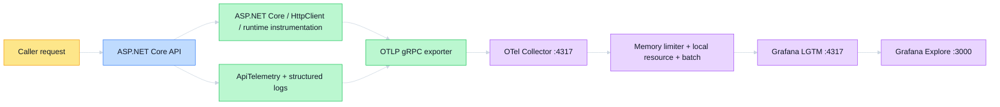

# Observability Guide

## Monitoring Strategy

The lab emits logs, metrics, and traces through OpenTelemetry so an integration failure can be
followed from the caller-visible Problem Details to server processing and the outbound provider
attempt. Observability is part of each client boundary; it does not include credentials, identities,
provider payloads, or unbounded caller values.

Primary questions:

- Is the API receiving and serving requests?
- Which bounded provider/operation is succeeding, failing, or being cancelled?
- Is latency changing for a known integration operation?
- Is failure authentication, authorization, configuration, throttling, timeout, or upstream?
- Can the Problem Details trace ID locate the same request in logs and traces?
- Is telemetry reaching the Collector and local LGTM backend?

## Signal Flow



The API sets `service.name=api-integration-lab` (and assembly service version). The Collector adds
`deployment.environment.name=local` consistently to logs, metrics, and traces.

## Metrics Catalog

| .NET instrument | Prometheus-style name | Type/unit | Labels | Meaning |
| --- | --- | --- | --- | --- |
| `api.client.requests` | `api_client_requests_total` | Counter | `provider`, `operation`, `outcome` | Completed integration operations |
| `api.client.request.duration` | `api_client_request_duration_seconds` (`_bucket`, `_sum`, `_count`) | Histogram, seconds | `provider`, `operation`, `outcome` | End-to-end client operation duration |
| `api.client.errors` | `api_client_errors_total` | Counter | request labels + `error.type` | Failed operations by bounded category |
| `api.auth.token.requests` | `api_auth_token_requests_total` | Counter | `flow`, `outcome` | Delegated/application token acquisition |

Automatic instrumentation also emits framework-version-dependent ASP.NET Core server, `HttpClient`,
and .NET runtime instruments. Treat those as categories and inspect the current backend schema; this
repository does not promise an exhaustive list of unstable auto-instrument names.

## Label and Attribute Taxonomy

| Label / attribute | Allowed values | Max combinations | Risk |
| --- | --- | ---: | --- |
| `provider`, `operation` | Seven allowlisted pairs | 7 | Low |
| `outcome` | `success`, `error`, `cancelled` | 3 | Low |
| `error.type` | `authentication`, `authorization`, `configuration`, `throttled`, `timeout`, `upstream` | 6, failures only | Low |
| `flow` | `delegated`, `application` | 2 | Low |

The code validates the provider/operation **pair**, not two independent lists. This prevents invalid
cross-products such as `public/users` from becoming new series.

Forbidden metric labels:

- request ID or trace ID;
- raw URL, path parameters, or query string;
- timestamp;
- user/object ID, email, UPN, repository name, or other identity/content;
- access token, PAT, password, cookie, HMAC secret, body, or signature;
- exception message, provider response, or other unbounded text.

Trace IDs belong in logs/traces for point lookup, not metrics. Spans may contain bounded
`provider`, `operation`, `outcome`, and `error.type`; the safety tests ensure tokens and
authorization data are absent.

## Cardinality Budget

The maximum custom attribute combinations before histogram bucket expansion are:

```text
api.client.requests:        7 provider/operation pairs × 3 outcomes = 21
api.client.request.duration: 7 pairs × 3 outcomes                    = 21
api.client.errors:           7 pairs × 6 error types                  = 42
api.auth.token.requests:     2 flows × 3 outcomes                     =  6
                                                                     ----
custom stream upper bound                                               90
```

Prometheus histogram buckets multiply the duration instrument into additional time series. The 90
figure is therefore a schema-level combination budget, not a claim that the backend stores exactly
90 series. Any new metric label requires recalculating both combinations and histogram expansion
before it ships.

## Logs

OpenTelemetry logging exports formatted messages, structured state, and scopes. The trace middleware
places `TraceId` in a logging scope. Provider clients log bounded completion facts such as provider,
HTTP status, page count, or result count—never request/response bodies or authorization material.

The webhook correlation integration test verifies that its secret, signed body marker, and
signature do not appear in structured logs. Avoid enabling `set -x`, verbose `curl`, request-body
logging, or configuration-object logging during credentialed diagnosis.

## Traces

Tracing includes:

- automatic ASP.NET Core inbound spans;
- automatic `HttpClient` outbound spans;
- `integration.request` custom spans with bounded provider/operation/outcome attributes;
- `demo.aggregate` span with one `provider.completed` event per provider envelope;
- parent context accepted through standard W3C `traceparent` propagation.

Problem Details uses `Activity.Current.TraceId`, so a normalized integration failure returns the
same trace identifier represented by server telemetry.

## Correlation Workflow

1. Reproduce the request and retain only the safe Problem Details response.
2. Copy its 32-character `traceId`.
3. Search logs for that exact value.
4. Open the matching Tempo trace and inspect server → client span timing/status.
5. Use custom metrics to decide whether the failure is isolated or a provider/operation trend.
6. Compare API, Collector, and LGTM logs only if the application trace never arrives.

This order moves from one known request to aggregate scope without turning a trace ID into a metric
dimension.

## Grafana Exploration

Open <http://localhost:3000> and use Explore.

Request volume:

```promql
api_client_requests_total
```

Rate by bounded dimensions:

```promql
sum by (provider, operation, outcome) (rate(api_client_requests_total[5m]))
```

Mean observed client duration over the window:

```promql
sum by (provider, operation) (rate(api_client_request_duration_seconds_sum[5m]))
/
sum by (provider, operation) (rate(api_client_request_duration_seconds_count[5m]))
```

This is a mean, not a percentile. Percentiles require histogram bucket queries and enough samples.

Log correlation:

```logql
{service_name="api-integration-lab"} |= "<trace-id-from-problem-details>"
```

Replace the angle-bracket value with the actual safe trace ID. In Tempo, search for
`service.name=api-integration-lab`; add `deployment.environment.name=local` when the UI/query mode
supports resource filtering.

## Collector Processing

| Component | Configuration | Purpose / limitation |
| --- | --- | --- |
| OTLP receiver | gRPC `0.0.0.0:4317`, HTTP `0.0.0.0:4318` | Accept all three signals inside Compose |
| Memory limiter | 1 s check, 256 MiB limit, 64 MiB spike | Bounds Collector memory; pressure may reject/drop telemetry |
| Resource processor | Upsert environment `local` | Consistent local isolation |
| Batch processor | 2 s timeout | Reduce export overhead; adds bounded delivery delay |
| OTLP exporter | `lgtm:4317`, insecure | Plaintext only inside the local Docker network |
| Health extension | `0.0.0.0:13133` | Collector process health inside the network |

Every signal uses the same processor order: `memory_limiter`, `resource`, `batch`.

## Retention and Sampling

This repository configures no application or Collector sampling policy and no retention guarantee.
LGTM container-local retention/storage behavior comes from its development image defaults and may
change across image upgrades or when containers/volumes are removed. Do not use this stack as a
durable evidence store.

## Alert and Dashboard Status

There are no checked-in Grafana dashboards, alert rules, folders, notification policies, on-call
routes, SLOs, or error-budget policies. Grafana Explore is the intentional learning interface.
Nothing in this document implies active monitoring or an operational response SLA.

## Troubleshooting the Pipeline

| Symptom | Check | Expected boundary |
| --- | --- | --- |
| No signals at all | `docker compose ps` and API logs | API exports to `http://otel-collector:4317` using gRPC |
| API exporter connection errors | `docker compose logs otel-collector` | Collector receiver listening on 4317 |
| Collector receives but cannot export | `docker compose logs lgtm` | LGTM OTLP endpoint listening on 4317 |
| Metrics but no custom series | Generate provider traffic; inspect API logs | `ApiTelemetry` records only completed operations |
| No log match by trace ID | Verify selected Loki source and time window | Log scope/export preserves trace context |
| Trace exists but no custom span | Confirm operation is one of seven pairs | Custom ActivitySource is registered |
| Unexpected series growth | Group/count labels; inspect auto-instrumentation | Custom schema rejects unbounded values |

Useful commands:

```bash
docker compose ps
docker compose logs --tail=200 api
docker compose logs --tail=200 otel-collector
docker compose logs --tail=200 lgtm
curl --fail --silent http://localhost:8080/health
curl --fail --silent http://localhost:3000/api/health
```

## Production Extension Guidance

Before adapting this pipeline beyond localhost:

- define service ownership, SLOs, alert routing, and response expectations from measured demand;
- authenticate/encrypt OTLP outside a private local network;
- size Collector memory, queues, batching, and retry from signal volume/failure testing;
- configure durable backend retention and access controls;
- decide head/tail sampling while preserving error/security investigations;
- deploy versioned dashboards/rules through infrastructure as code;
- estimate new metric labels with histogram expansion and expected workload cardinality;
- retain OTel-native application instrumentation and keep vendor routing in the Collector.

These are prerequisites and design tasks, not capabilities present in this repository.
