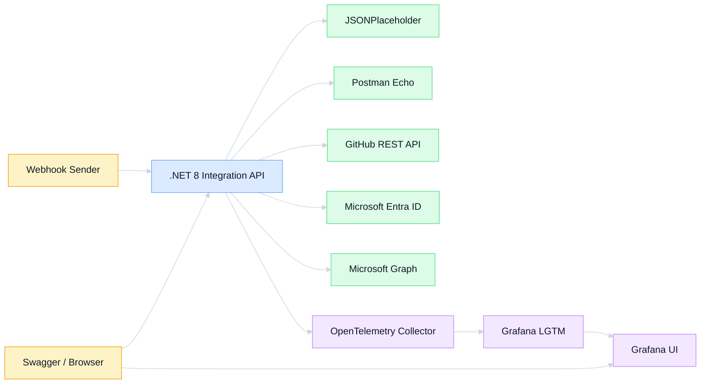

# API Integration Lab Design

**Date:** 2026-09-16
**Status:** Approved in conversation
**Source:** `req.md`

## Purpose

Build a locally reproducible .NET 8 Web API that demonstrates API integration breadth and the
production concerns surrounding it. The lab must show unauthenticated REST, outbound Basic Auth,
GitHub bearer authentication, Microsoft delegated OAuth 2.0 Authorization Code, Microsoft
application OAuth 2.0 Client Credentials, and inbound HMAC authentication. It must also demonstrate
serialization, pagination, rate limits, retries, timeouts, error handling, secret management, and
OpenTelemetry-based observability.

The primary showcase is Swagger plus local Grafana. A manager must be able to start the stack,
execute each authentication path, inspect normalized responses, and see the associated logs,
metrics, and traces without needing a separate frontend.

## Scope

### Included

- .NET 8 ASP.NET Core Web API with Swagger at `http://localhost:8080/swagger`.
- Public JSON API integration using JSONPlaceholder.
- Basic Auth integration using Postman Echo.
- GitHub REST integration using a personal access token or compatible bearer token.
- Microsoft Graph delegated integration using Authorization Code and `User.Read`.
- Microsoft Graph application integration using Client Credentials and application `User.Read.All`.
- Inbound HMAC-SHA256 webhook authentication with replay protection.
- An aggregate endpoint that calls Public API, GitHub, and delegated Microsoft Graph concurrently.
- Bounded pagination, rate-limit parsing, transient retries, timeouts, typed errors, and RFC 7807
  problem responses.
- OpenTelemetry logs, metrics, and traces sent through a standalone OpenTelemetry Collector to a
  local Grafana LGTM backend.
- Dockerfile, Docker Compose, collector configuration, secret template, tests, smoke tests, and a
  complete README.
- Inline comments and Swagger descriptions that explain protocol mechanics where they are used.

### Excluded

- Azure deployment or other cloud infrastructure.
- A custom frontend.
- Persistent application storage or a distributed token cache.
- Production multi-instance session handling.
- Certificate-based client credentials.
- Mutation of GitHub or Microsoft Graph resources.

These exclusions keep the implementation suitable for a focused local proof of capability while
leaving every authentication mechanism in the source requirements functional end to end.

## Architecture

The application is a modular monolith: one deployable API project with feature folders and explicit
interfaces between controllers, authentication helpers, typed integration clients, normalization,
and telemetry. This makes the complete flow easy to demonstrate without creating project boundaries
that add ceremony but no useful isolation for the lab.



### Source layout

```text
src/ApiIntegrationLab.Api/
├── Authentication/
│   ├── GitHub/
│   ├── Microsoft/
│   └── Webhooks/
├── Common/
│   ├── Errors/
│   ├── Http/
│   ├── Models/
│   └── Telemetry/
├── Integrations/
│   ├── BasicAuth/
│   ├── Demo/
│   ├── GitHub/
│   ├── MicrosoftGraph/
│   └── PublicApi/
├── Properties/
├── Program.cs
└── appsettings.json

tests/
├── ApiIntegrationLab.UnitTests/
└── ApiIntegrationLab.IntegrationTests/
```

Each feature folder owns its controller, client interface and implementation, provider DTOs, and
normalized response models. Shared HTTP behavior, errors, and telemetry live under `Common` only
when at least two integrations consume them.

## Authentication Flows

### Public API

The public client sends an unauthenticated `GET` request to JSONPlaceholder and deserializes the
response into provider DTOs before returning a smaller normalized representation. The endpoint
accepts a bounded result limit so the demo never returns the entire upstream collection by accident.

### Basic Authentication

The Basic client encodes `username:password` as Base64 and sends it in the `Authorization: Basic`
header to Postman Echo. Credentials come only from configuration. Neither the raw pair nor the
encoded header is logged or returned. The code comments make clear that Base64 is transport
encoding, not encryption, and therefore Basic Auth requires HTTPS.

### GitHub Bearer Token

A delegating handler reads the configured GitHub token and adds `Authorization: Bearer`,
`Accept: application/vnd.github+json`, a configured `User-Agent`, and a pinned GitHub API-version
header. When no token is configured, it deliberately omits `Authorization` so `/user` demonstrates
the upstream authentication failure before the token is supplied.

Repository pagination follows the GitHub `Link` header with `rel="next"`. It stops when there is no
next link, `maxPages` is reached, or cancellation is requested. It never constructs an unbounded
loop from response length alone. Rate-limit values are parsed from GitHub's response headers and
returned as normalized numeric values and a UTC reset instant.

### Microsoft Delegated Authorization Code

Microsoft.Identity.Web configures cookie and OpenID Connect authentication. `/api/microsoft/login`
challenges the OpenID Connect scheme, the browser signs in and consents, and Entra redirects to
`/auth/microsoft/callback`. The middleware validates state and nonce, redeems the single-use code,
stores tokens in the server-side in-memory cache, and creates the local encrypted session cookie.

`/api/microsoft/me` obtains a delegated token for `User.Read` from the token cache and calls
`GET https://graph.microsoft.com/v1.0/me`. Access and refresh tokens never enter API responses or
application logs. `/api/microsoft/logout` clears both the local cookie and the provider session.

### Microsoft Application Client Credentials

`/api/microsoft/users` obtains an application token for
`https://graph.microsoft.com/.default` and calls `GET /v1.0/users` with a bounded `$top` and a
fixed `$select`. The Entra app registration must have the application permission `User.Read.All`
with admin consent. This flow represents the workload itself; it never depends on the signed-in
user and never calls `/me`.

### HMAC Webhook

`POST /api/webhooks/events` requires:

- `X-Webhook-Timestamp`: Unix time in seconds.
- `X-Webhook-Signature-256`: `sha256=` followed by the lowercase hex HMAC.

The signed bytes are `timestamp + "." + raw request body`. The API rejects timestamps more than
five minutes from the injected clock, computes HMAC-SHA256 over the exact received bytes, and uses a
constant-time comparison. A successfully verified digest is atomically cached until its signed
timestamp expires, so an identical delivery is rejected even inside the freshness window. It parses
the JSON only after authentication and never logs the body or signature. This prevents body
re-serialization differences from invalidating a correct signature and provides replay protection
for the single-instance local lab; replicas would require a shared delivery-ID store.

## HTTP API

| Method | Route | Behavior |
|---|---|---|
| `GET` | `/api/public/posts?limit=10` | Returns normalized public posts; `limit` is 1–100. |
| `GET` | `/api/basic/profile` | Calls Postman Echo with Basic Auth and returns authentication state. |
| `GET` | `/api/github/profile` | Returns normalized authenticated-user data. |
| `GET` | `/api/github/repos?perPage=30&maxPages=3` | Returns normalized repositories and pagination metadata. |
| `GET` | `/api/github/rate-limit` | Returns GitHub core rate-limit data. |
| `GET` | `/api/microsoft/login` | Starts the delegated browser sign-in flow. |
| `GET` | `/auth/microsoft/callback` | OIDC middleware callback; not application business logic. |
| `GET` | `/api/microsoft/me` | Returns the delegated user's normalized Graph profile. |
| `GET` | `/api/microsoft/users?top=10` | Returns 1–50 users through app-only Graph access. |
| `GET` | `/api/microsoft/logout` | Clears the local and Entra sessions. |
| `POST` | `/api/webhooks/events` | Authenticates and acknowledges a signed event. |
| `GET` | `/api/demo` | Aggregates Public API, GitHub, and delegated Graph concurrently. |
| `GET` | `/health` | Reports application liveness without requiring external credentials. |

Swagger descriptions state required configuration, the authentication flow, expected failure modes,
and the order in which a user should exercise the routes.

## Normalization and Aggregation

Provider DTOs never escape their integration client. Each client maps only the fields needed by the
demo:

- Public post: ID, title, and abbreviated body.
- Basic Auth result: provider and authenticated state.
- GitHub profile: login, display name, public repository count, and profile URL.
- GitHub repository: name, description, visibility, URL, and last-updated instant.
- Graph profile/user: ID, display name, mail, and user principal name.
- Webhook acknowledgement: accepted event type and receipt time.

`/api/demo` requires a delegated Microsoft session, starts its three provider calls concurrently,
and returns a stable envelope for each provider containing `status`, `data`, and a safe error summary.
It returns HTTP 200 if at least one provider succeeds and a gateway problem response if every provider
fails. A slow or failing provider does not discard successful provider results.

## Resilience and Error Handling

Every provider uses a named or typed `HttpClient` with a finite timeout. The standard .NET resilience
pipeline retries only idempotent transient outcomes: timeouts, HTTP 408, HTTP 429, and HTTP 5xx.
Retries use bounded exponential backoff with jitter and honor `Retry-After`. Authentication failures,
authorization failures, validation failures, and cancellation requested by the caller are not
retried. GitHub's rate-limit form of HTTP 403 is recognized from its headers and reported without an
immediate retry.

Provider failures map to typed exceptions and then RFC 7807 responses with safe extensions:

- `provider`
- `category`
- `traceId`
- `retryAfterSeconds`, when supplied upstream

The API never copies upstream bodies into client-facing error details because they can contain
provider-specific or sensitive information. Missing optional configuration does not prevent process
startup. An endpoint that requires absent Microsoft, Basic, or HMAC configuration returns an
actionable HTTP 503 problem. The tokenless GitHub profile call is allowed to reach GitHub so the
demonstration can show the expected HTTP 401 authentication failure. Upstream throttling maps to
HTTP 429 with `Retry-After`; upstream timeout and unavailable outcomes map to HTTP 504 and HTTP 503;
other invalid upstream responses map to HTTP 502.

## Observability

OpenTelemetry automatically instruments ASP.NET Core requests and outbound `HttpClient` calls.
Explicit activities cover token acquisition, pagination, response normalization, and aggregate
fan-out. Structured logs record provider, operation, status code, duration, retry decision, and trace
correlation while excluding credentials, authorization headers, cookies, signatures, request bodies,
and tokens.

Custom metric dimensions are enumerated values rather than input-derived strings:

| Metric family | Dimensions and estimated values | Maximum active series |
|---|---|---:|
| API client requests | provider (4) × operation (8) × outcome (3) | 96 |
| API client duration histogram | same dimensions × about 13 bucket/count/sum series | 1,248 |
| API client errors | provider (4) × operation (8) × error type (6) | 192 |
| Auth token requests | flow (2) × outcome (3) | 6 |
| **Total** | 15-second export interval | **about 1,542** |

The .NET meter instruments are named `api.client.requests`, `api.client.request.duration`,
`api.client.errors`, and `api.auth.token.requests`. The Prometheus-compatible backend renders the
counter families with the conventional `_total` suffix.

At full population this is about 103 samples/second. The destination is the local Prometheus backend,
so paid ingest cost is zero and the cardinality risk is low. Request IDs, user IDs, repository names,
raw URLs, tenant IDs, and timestamps are prohibited as metric labels; request-specific correlation
belongs in logs and traces.

The application exports OTLP to the standalone collector. The collector applies memory limiting,
batching, and resource enrichment, then exports OTLP to Grafana LGTM. Grafana is available locally
with preconfigured data sources for the resulting Loki logs, Prometheus metrics, and Tempo traces.

## Configuration and Secret Handling

`.env.example` lists every required variable with an empty value and an adjacent explanation. The
developer copies it to the ignored `.env` file. Compose maps those values to hierarchical ASP.NET
Core configuration keys.

The application binds and validates strongly typed options at endpoint use. This allows the process,
public endpoint, health endpoint, Swagger, and telemetry to run before optional credentials are
present. Logs report only the missing configuration key name, never its value.

The README includes exact Entra app-registration instructions:

- Web redirect URI: `http://localhost:8080/auth/microsoft/callback`.
- Delegated permission: `User.Read`.
- Application permission: `User.Read.All` with admin consent.
- Logout return URL for the local application.

## Inline Explanation Standard

The code must be understandable without opening external protocol documentation. Comments are
required where the reason is not evident from syntax:

- Why Basic credentials require HTTPS despite Base64 encoding.
- Why GitHub sends specific media type, version, and user-agent headers.
- Why pagination follows `Link` rather than inferring another page from item count.
- Why delegated `/me` and app-only `/users` use different token acquisition methods.
- Why tokens and high-cardinality identifiers are excluded from logs and metrics.
- Why only transient idempotent calls are retried.
- Why webhook verification uses the raw body, timestamp window, and fixed-time comparison.
- Why optional secret validation occurs at endpoint use rather than application startup.

Routine property assignment, dependency injection registration, and obvious control flow do not
receive comments that merely restate the code. XML documentation and Swagger descriptions explain
the externally visible contract; focused inline comments explain protocol and security decisions.

## Testing and Validation

Implementation follows test-driven development. Automated tests do not contact live providers and
do not require secrets.

### Unit tests

- Basic header formation and missing configuration.
- GitHub bearer headers, no-token behavior, pagination termination, rate-limit parsing, and bounded
  page limits.
- Delegated versus application Graph token selection and normalized mapping.
- HMAC valid signature, invalid signature, stale timestamp, malformed timestamp, identical-delivery
  replay rejection, and exact raw-body behavior.
- Retry classification, error mapping, redaction, normalization, aggregate partial success, and
  aggregate total failure.
- Telemetry dimensions remain in the documented bounded sets.

### Integration tests

- Route/status/Problem Details behavior through `WebApplicationFactory`.
- Swagger document contains all documented routes and descriptions.
- Authentication challenge and callback configuration.
- Dependency-injected fake upstream handlers produce deterministic success, timeout, throttling,
  authentication failure, and server-failure scenarios.
- Health remains successful when optional credentials are absent.

### Executable validation

- Restore, Release build, and all .NET tests.
- Docker image build.
- Docker Compose configuration rendering.
- OpenTelemetry Collector configuration validation.
- Compose startup and container health checks.
- A checked-in smoke-test script for health, public, Basic, tokenless/configured GitHub, HMAC, and
  the configuration-visible Microsoft endpoints.
- Manual live checks for Microsoft delegated sign-in, `/me`, app-only `/users`, `/api/demo`, and
  trace/log/metric correlation in local Grafana.
- README capture of the final architecture, authentication matrix, local setup, API examples,
  security constraints, and representative Swagger/Grafana output from the validated stack.

## Acceptance Criteria

1. `docker compose up --build` starts the API, collector, and local Grafana stack.
2. Swagger loads at `http://localhost:8080/swagger` and documents how to exercise every route.
3. Each authentication mechanism in the source requirements has a functional endpoint and tests.
4. GitHub repository pagination and rate-limit metadata are observable and bounded.
5. Both Microsoft flows make real Graph calls when valid Entra configuration and consent exist.
6. The HMAC endpoint rejects missing, invalid, or replayed signatures and accepts a correctly signed
   event.
7. The aggregate endpoint normalizes provider responses and preserves partial successes.
8. Transient failures are retried within the configured budget; auth and validation failures are not.
9. No secret, token, authorization header, cookie, signature, or webhook body appears in logs or API
   error responses.
10. Grafana displays correlated logs, metrics, and traces from a smoke-test request.
11. All automated tests, Release build, Docker build, Compose render, collector validation, and smoke
    checks pass.
12. Protocol and security decisions are explained inline at their implementation points, so source
    readers do not need external documentation to understand the flows.
